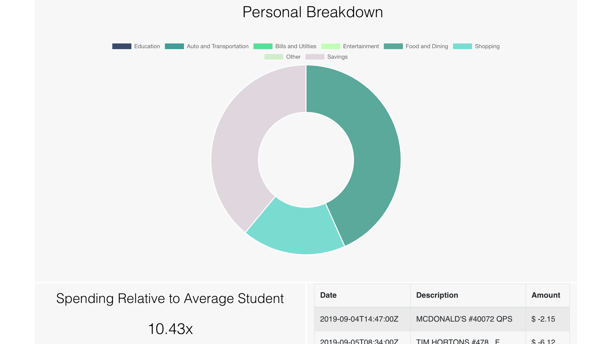

# TD Student Analyzer
Project built during Hack the North 2019 using React for the frontend and Flask for the backend. Utilizes TD Da Vinci API to provide spending analysis for students.

## Tools Used:
- React
- Flask
- TD Da Vinci API

